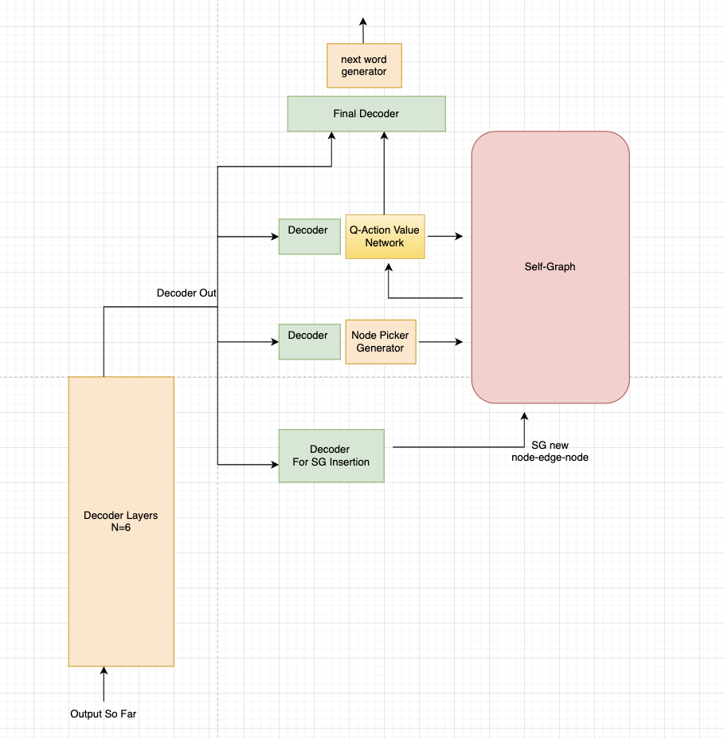

# White Paper for Vamber's LLM Architecture
 Vamber Yang, Linlin Chen

A 2B LLM which uses memory graph for factual reasoning and long term memory and RL for hierarchical planning and logical deduction. 

## Motivations

Lex Fridman: "Let's talk about AGI a little bit. What do you think it takes to build a system of humanlevel intelligence? We talked about reasoning. We talked about long term memory. But in general, what does it take you think?" 
Ilya Sutskever: "Deep learning **plus some ideas**, and I think self play will be one of those ideas."

This section, I will address some intrinsic limitations of the vanilla transformers architecture. 
The insights and perspectives offered here are much more novel than my own silly LLM design.
But I believe further thoughtful investigation to these problems could reveal the missing pieces to AGI.

### 1. Separation of Facts and Logics

**Observation**:  
Suppose one day I say to my friend: "Hey, the capital city of France is London". My friends would then
laugh at me and then say: "No, it's Paris".  
After confirming this fact on internet, I realized I made a mistake. 
And by some magical procedure, I will somehow swap out word "London" which forms associative memory with "Capital city of France", and replace it with "Paris".
I can perform this procedure so efficiently and quickly, if my friend ask me on the spot again, I can say "Yeah, the capital is Paris".
I didn't do anything that foundamentally change my brain. I still understand that France is a nation, what's the idea of being captial city, and the common senses such that a city will have some populations, etc...

**Limitation**:  
However, if the transformers has made the same mistake as I did. The only way to correct it (making it to say Paris) is to retrain entire transformers, and all the billions of parameters will be affected.
More interestingly, it will perform a gradient descent according its loss function, 
it's going to gradient descent from a continous representation of "London" into "Paris" within its hidden layers. 
And it will probably take a few iterations of weight updating for the transformers to finally learn the correct answer.
Yet, this process is non-intuitive.
Because facts have a more discrete nature than a continous one. We don't try to 
perform an iterative gradient descent from "London" to "Paris", because it makes no sense.
We can just directly one-hop from Fact-A to Fact-B.
The underlying limitation with transformers is that 
the many hidden decoder layers are tasked with storing both logics (or common sense, language ability,etc) and facts all together.
One, this makes LLM huge, as it must store the entire world knowladge as weights.
Two, due to this nature, the only way to acquire new facts or correcting false-believed facts is to retrain the entire network,
thus making this process unnecessarily difficult.

**Solution**:  
The goal here is to create a separation between facts and logic, by explicitly integrating a knowladge graph into the model.
The hope is that the decoder layers will primarily focus on logic and intuition,
removing its burden of storing world knowladge. This will make the model more light weight too.
During inference, the model will consider its hidden states based on inputs, 
and make many relevant queries (up to thousands) to the knowladge graph, forming multiples of fact chains
(something like: France -> has -> capital -> is -> Paris -> is -> city ...). 

The final layer decoder will treat the facts and fact chains as widgets ready for assemble. 
The aggregation of fact chains and previous decoder layers' output determine the final next word. 
When this model is been trained on more texts of different topics, 
it's knowladge graph will keep growing bigger, while the underlying decoders' parameter count stays constant.
The models learns more things without bigger.  

I also want to motivate how this is similar to human learning too. 
Consider a middle school student (who has acquired many common sense and established a reasoning system), 
when he reads more books (science or fictions), 
the act of reading is disproportionally expanding his 
knowladge base than to changing his reasoning system. 
Human's thinking system is much more like a kernel, operating on the realm of underlying facts, 
which the latter is much more elastic to insertion and deletion at every moment.  

Later you will also see this KG here is not coming from any open-sourced knowladge graphs, 
but rather it's generated by the model itself through curriculum learning.
And how this model's interaction with KG is foundamentally differently from a retrieval system.

\<to do> should I talk about alternative choices and why KG has good properties here ?

### 2. Traditional Next Word Prediction Training Disencourages Slow Thinking
**Observation 2a**:  
The following comes from Ilya when he is talking about next word prediction for transformer's reasoning:  
"so I'd like to take a small detour
and to give an analogy that will
hopefully clarify why more accurate
prediction of the next word leads to
more understanding, real understanding.
let's consider an example
say you read a detective novel,
it's like a complicated plot a storyline
different characters lots of events.
Mysteries like Clues it's unclear then
let's say that at the last page of the
book the detective has got all the clues
gathered all the people and saying okay
I'm going to reveal the identity of
whoever committed the crime and that
person's name is predict that word
"

**Limitation 2a**:  
Transformer's architecture, by nature, is agnostic to the difficulty of predicting
next word. For example, some next token are easy to predict, such as "a", "is", "of", "that",
since they are just words for grammar purposes. Some next token are extremely hard, such as 
predicting who is the murder of a case. Yet, for both cases above, they will both just be embedded
inputs flowing through identical weights exactly once with no recurrance, ultimately becomes one probability vector.
In a sense, transformers will never put more efforts into more difficult task.
Once again, consider the observation above, if the transformers is tasked with 
predicting the murder, then it needs to do all logical deduction within one forward pass.
All reasoning such as evaluating all possible candidates, recalling evidences, doing hypotheis testing,
figuring contradiction and re-iterate hypothesis, and etc. all needs to happen within this one forward pass.
No matter how big you can your LLM, there would always be a difficult problem that require more logical effort
than one forward pass can encompass. 

**Observation 2b**:  
I came to a realization that, any human language, either spoken or written, 
are just compression or conclusion thoughts. When we write, we always put few seconds (if not minutes)
of thought thinking about what to write, evaluating different possible main idea of sentence. 
What to write? What not to write? What makes sense? Sometimes even deleting things we wrote and
replace it with something else. Yet, this is actually the most valuable process and insights towards
the generation of the sentence (therefore each individual next token). Yet, no one really write down their
thought process, only the final texts is published.  
Consider the two examples below:  
1. One day I causally said:"Let's just go to the food court and explore around and see what's for dinner"
But after a meditation to words, I realized what really happened was, I thought in my brain 
"wow, I am feeling some chickfila today. Oh it's sunday, they are not open. 
How about Pizza? hmm. just had pizza two days ago. Maybe just somewhere close ? 
Oh there is a Chikfila 0.2 mile away, I can just walk there. Oh, it's Sunday. 
Yeah, I don't know what I am feeling. There was a food court I saw last week, they got
different things there. Yeah, why don't I just go there". 
All my thought bubbles are not spoken, yet they are the entire reason why I said what I said.
2. One of my highschool's American History quiz was: write down two main causes of the great depression.
When I was doing the quiz, I thought about five different causes. For each one, I was evaluating its historical importance
and how well I could explain its details. I also compared them and rank them to see perhaps which one
my history teach would like more. Of course, in the end I only wrote 2 causes. But there were much informations cross examined
and distilled into the final answer. My brain still auto-regressively genertated those five causes and the reasons. It's just that
they are not written down on the paper. 

**Limitation 2b**:  
If it is indeed true that all written texts are just compression or conclusion of thoughts, 
then all training data is unfriendly for transformers.
Since the training is all about the accuracy of next word generation, it's diffcult for 
the transformers to predict when the original author has put down 
many thoughts into a particular word. Whereas the transformers has to do everything the author
did within just one forward of the layers. If transformer are trained on such data, then it can
never learn the thought process behind the text, nor learn how to put in disproportional logical 
effor based on the difficulty of the problem.

**Solution**:  
1. To do: talk about to re-format training data
2. To do: talk about recurrance, and how using context window as this scratch pad is also recurrance
3. To do: talk about how this process can lead to RL training

The idea I want to impressive upon you is that: 
by allowing the transformer to output an arbitrary number of words into the context window 
before answering the desired next token,
we can finally integrate true reinforcement learning into LLM's training. 
Traditionally, we can't explicitly train LLM's reasoning ability, since everything relies 
only on the next token accuracy. There can be a notion of reward (getting the next token correct), but there is no well defined action space. 
But now, we can allow LLM to explore different sequence of action,
namely, what chain of thoughts of explore and evaluate, before arriving to the answer.
(more concretely, the actions are what path the model decides to explore on memory graph, details discussed later).

On that note, we have achived slow thinking for the model. 

Note, this is foundamentally different from CoT or ToT, since they are just prompt engineer techniques.
Those prompting engineering technique still relies on the underlying model's ability, and they are also not trainable. 
If a model get 45% on a benchmark, CoT can probably improve the score by 3% or something.
But it would never bring drastic changes to the model's reasoning ability nor create emergent properties.

